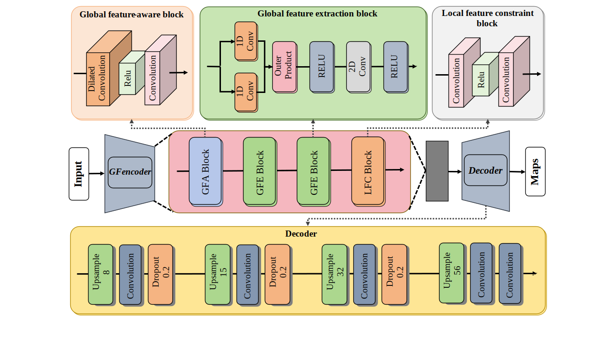

# GLAE


<!-- PROJECT SHIELDS -->
<!-- PROJECT LOGO -->
<br />
<p align="center">
  <a href="https://github.com/JHC521PJJ/GLAE/tree/master/">
    
  </a>

  <h3 align="center">Global-local Feature Autoencoder for Image Logical Anomaly Detection</h3>
  <p align="center">
| <a href="https://doi.org/10.21203/rs.3.rs-3842133/v1"><b>Paper</b></a> | 
  
  </p>

</p>

---

Official code for the paper: GLAE: global-local feature autoencoder for image logical anomaly detection. GLAE employs a novel global feature extractor as the encoder (GFencoder), which introduces one-dimensional convolutions in two differ-ent directions to extract global semantic information from images, followed by two-dimensional convolutions for local feature constraints. This design significantly reduces computational costs while reconstructing global-local information of images. 

---

## 📸 Results

| Model         | Dataset    | Official Paper | Our Reproduction |
|---------------|------------|----------------|----------------|
| EfficientAD-M | VisA       | 98.1           | 98.1        |
| EfficientAD-M | Mvtec LOCO | 90.7           | 89.9           |
| EfficientAD-M | Mvtec AD   | 99.1           | 99.1           |
| GLAE | VisA       | -          | 98.2        |
| GLAE | Mvtec LOCO | -           | 91.1           |
| GLAE | Mvtec AD   | -          | 98.2           |

## 🛠️ Setup

### Packages

```
Python==3.10
torch==2.0.1
torchvision==0.15.2
tifffile==2023.4.12
tqdm==4.65.0
scikit-learn==1.2.2
numpy==1.23.5
Pillow==9.3.0
scipy==1.10.1
tabulate==0.9.0
opencv-python==4.7.0.72
```

## 🗝️ Training and Evaluation

Training with MVTec LOCO:
```
python3 main.py --subdataset screw_bag --mvtec_loco_path path/mvtec_loco --train_steps 65000 --device_gpu 0 --output_dir output --weights path/your_model.pth
```

Evaluation with MVTec LOCO:

```
python3 inference.py 
```

## 🤝 Mvtec LOCO Dataset

Download dataset:

```
mkdir mvtec_loco_anomaly_detection

cd mvtec_loco_anomaly_detection
wget https://www.mydrive.ch/shares/48237/1b9106ccdfbb09a0c414bd49fe44a14a/download/430647091-1646842701/mvtec_loco_anomaly_detection.tar.xz
tar -xf mvtec_loco_anomaly_detection.tar.xz
cd ..
```

